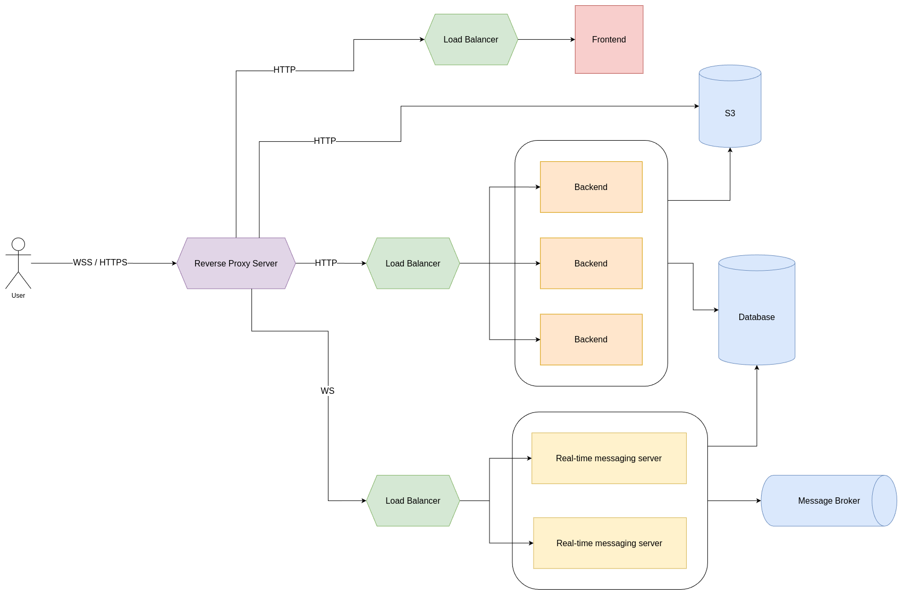

<h1 align="center">Вітаємо на Auction INT20H проєкті 👋</h1>

## ✨ Архітектура
Архітектура проєкта була розроблена з врахуванням можливості маштабування любого сервіса:

<p>
  
</p>

В ролі Reverse Proxy Server та Load Balancer виступає [Traefik](https://traefik.io/traefik/) \
В ролі S3 виступає [Minio]() \
В ролі Database виступає [PostgreSQL](https://www.postgresql.org/) \
В ролі Real-time messaging server виступає [Centrifugo](https://centrifugal.dev/) \
В ролі Message Broker виступає [Redis](https://redis.io/) \
В ролі Backend виступає сервіс написаний за допомогою [ASP.NET Core](https://dotnet.microsoft.com/en-us/apps/aspnet) \
В ролі Frontend виступає сервіс написаний за допомогою [React](https://react.dev/)

---

Всі сервіси контейнеризовані та виконуються в [Docker](), конфігурація для кожного контейнера описана в [compose.yaml](./compose.yaml) файлі 

В директорії [configs](./configs/) зберігаються конфігурації які необхідні для різних сервісів 

По шляху [configs/postgres/scripts](./configs/postgres/scripts/) знаходяться скрипти, ця папка монтується в контейнер по шляху /docker-entrypoint-initdb.d і скрипти з цієї папки всередині контейнера виконуються під час ініціалізації PostgreSQL і при умові, що volume а саме postgres_data цього контейнеру пустий, в цій папці містяться sql скрипт для створення табличок для бібліотеки [Quartz.NET](https://www.quartz-scheduler.net/) та sql скрипт для створення таблички та тригера для інтеграції з Centrifugo та реалізації паттерна Outbox 

По шляху [configs/traefik/routing](./configs/traefik/routing/) знаходяться файли конфірації маршрутизації Traefik для сервісів 

Сервіс Backend слідує принципам REST, завдяки тому що цей сервіс stateless він може маштабуватись без проблем 

Real-time messaging server використовується як WebSocket сервер та синхронізує повідомлення між декількома нодами завдяки механіхму Pub/Sub в Redis, тому він може маштабуватись без проблем

Centrifugo канали:
- tests.opened - канал для читання та відправки подій про відкриття завдань
- tests.closed - канал для читання та відправки подій про закриття завдань

В контейнері Frontend запущений [nginx](https://nginx.org/en/) який віддає статичні файли із розширеннями .html, .js та інші

Використаний [smtp4dev](https://github.com/rnwood/smtp4dev) для відправлення електронних листів

За допомогою Quartz реалізований механізм запланованої розсилки електронних листів, відкриття та закриття завдання

---

Проєкт запущений за на віртуальній машині в AWS хмарі за допомогою сервісу [EC2](https://aws.amazon.com/ec2/)

[Trafik dashboard](https://traefik.jwp-team.com/dashboard/#/) \
[Minio console](https://minio.jwp-team.com/) \
[Smtp4dev](https://smtp4dev.jwp-team.com/) \
[Backend swagger](https://jwp-team.com/backend/swagger/index.html) \
[Backend banana cake pop](https://jwp-team.com/backend/graphql/) \
[Centrifugo dashboard](https://centrifugo.jwp-team.com/) \
[Frontend](https://jwp-team.com/) 

Backend api - https://jwp-team.com/backend/ \
Centrifugo api - https://jwp-team.com/centrifugo/ \
Minio api - https://jwp-team.com/static/

## 🚀 Запуск

Клонування репозиторія 

```sh
git clone https://github.com/Danchikon/edupulse.deploy.git --recurse-submodules
```

Потрібно встановити [docker compose]() та [docker]()
```sh
docker compose up -d
```

## 📝 License

Copyright © 2024 [Daniel Hrovinsky](https://github.com/Danchikon)  [Denys Tvardovskyi](https://github.com/DenysTvardovskyi). \
This project is [MIT](https://github.com/kefranabg/readme-md-generator/blob/master/LICENSE) licensed.
